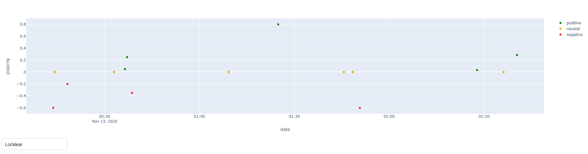

# Twitter Sentiment Analysis [FR]
Relève le ressenti positif ou négatif de tweets récents associé à un mot clé

Par Fabien CHARLIER, Antoine DEBOUCHAGE, Danyel GOLBOL, Alexandre SAJUS

## Utilisation
-téléchargez et extrayez le projet dans un dossier

-entrez des clés Twitter API dans twitter_collect/credentials.py

-exécutez Run.py

-cliquez sur le lien que vous donne la console ("Running on http://...")

## Librairies nécessaires
json, numpy, textblob, matplotlib, tweepy, pandas, os, dash, plotly
